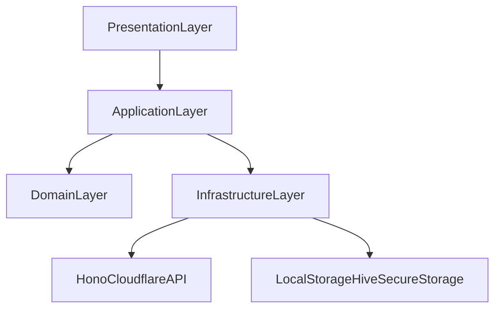
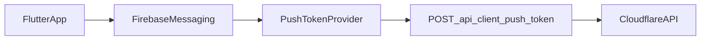

# Flutter Foundation Architecture (Android V1)

## Technical stack decisions
- **Flutter channel**: stable
- **Target**: Android first
- **State management**: `riverpod` (`flutter_riverpod`)
- **Navigation**: `go_router`
- **Networking**: `dio`
- **Cookie persistence**: `dio_cookie_manager` + `cookie_jar`
- **Secure storage**: `flutter_secure_storage`
- **Push**: `firebase_messaging`
- **Local cache**: `hive` (lightweight) for catalog/offline snippets
- **Forms/validation**: `formz` or `reactive_forms` (team preference)
- **Internationalization**: `intl` (FR default)

## Layered architecture
Use feature-first + clean boundaries:



### Responsibilities
- **Presentation**
  - screens/widgets
  - view models (state notifiers/providers)
- **Application**
  - use cases: login, fetch catalog, create order, create rdv
- **Domain**
  - entities: `Client`, `Product`, `Order`, `Rdv`, `MaintenanceRequest`
  - repository interfaces
- **Infrastructure**
  - API clients (`AuthApi`, `CatalogApi`, `OrderApi`, `RdvApi`, `ClientApi`)
  - DTO mappers
  - persistence adapters

## Suggested folder structure
```text
mobile_app/
  lib/
    app/
      router/
      theme/
      bootstrap/
    core/
      network/
      storage/
      errors/
      utils/
    features/
      auth/
        data/
        domain/
        presentation/
      home/
      catalog/
      cart/
      checkout/
      simulator/
      rdv/
      client_space/
      notifications/
      support/
    shared/
      widgets/
      design_tokens/
```

## Routing map (V1)
- `/splash`
- `/onboarding`
- `/auth/login`
- `/auth/register`
- `/home`
- `/catalog`
- `/catalog/:id`
- `/simulator`
- `/cart`
- `/checkout`
- `/payment/webview`
- `/rdv/create`
- `/client-space`
- `/client-space/orders/:id`
- `/notifications`
- `/support`

## Auth/session strategy
- Keep backend cookie session (`maasga_session`).
- Mobile stores cookies in persistent cookie jar.
- On app launch:
  1. Rehydrate cookies.
  2. Call `/api/session-check`.
  3. Route to login or home.
- For logout:
  - Call `/api/logout`.
  - Clear cookie jar + secure storage.

## Networking conventions
- Base URL in env (`--dart-define=API_BASE_URL=...`).
- Shared `Dio` instance with:
  - timeout policy
  - retry interceptor (idempotent routes only)
  - auth/session error interceptor (401 -> force relogin)
  - request/response logging (debug only)

## Error handling model
- Map errors into app-safe failures:
  - `NetworkFailure`
  - `AuthFailure`
  - `ValidationFailure`
  - `BusinessFailure`
  - `UnknownFailure`
- UI rule:
  - always show action-oriented messages
  - include retry CTA on transient failures

## Theming and design tokens integration
- Single `AppTheme` built from token files:
  - colors
  - typography
  - spacing/radius/elevation
  - component variants (buttons/cards/inputs/chips)

## Push architecture


- Register FCM token after login.
- Refresh token on `onTokenRefresh`.
- Support topic or user-targeted notifications in backend (future enhancement).

## Security baseline
- No token in plain shared prefs.
- PII minimized in logs.
- Disable verbose HTTP logs in release.
- SSL only.

## Delivery baseline for engineers
1. Bootstrap app shell (router/theme/network/storage).
2. Implement auth + session restoration.
3. Build catalog + product detail + cart state.
4. Integrate order + payment webview return handling.
5. Add simulator + rdv + client-space aggregates.
6. Integrate push + notifications center.

## Required backend add-ons tracked from audit
- `POST /api/login` JSON mode
- `GET /api/client/dashboard`
- `POST/DELETE /api/client/push-token`
- `POST /api/simulateur/btu` (recommended)
