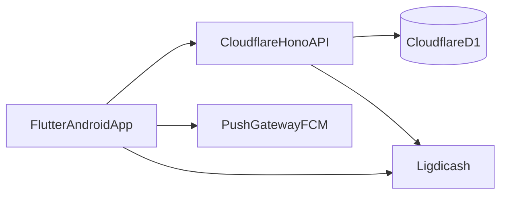

# CDC Application Mobile Flutter MAASGA (V1)

## Objectif produit
Créer une application mobile e-commerce Flutter (priorité Android) alignée sur le site MAASGA, pour permettre aux clients de découvrir les produits, simuler la puissance BTU, commander/payer, gérer leurs rendez-vous et suivre leur espace client.

## Cibles V1 validées
- Plateforme: Android uniquement.
- Backend: réutilisation de l’API existante (Hono/Cloudflare).
- Paiement: Ligdicash via WebView/redirect.
- Modules obligatoires:
  - Authentification (inscription, connexion, reset).
  - Catalogue + panier + commande.
  - Simulateur BTU.
  - Prise de rendez-vous (devis/installation/maintenance).
  - Espace client.
  - Notifications push.
  - Chat/support.

## Références backend existantes à réutiliser
- API principale Hono: [C:/Users/sayta/Downloads/Telegram Desktop/maasga-code/src/index.tsx](C:/Users/sayta/Downloads/Telegram Desktop/maasga-code/src/index.tsx)
- Modèles/types métiers: [C:/Users/sayta/Downloads/Telegram Desktop/maasga-code/src/types.ts](C:/Users/sayta/Downloads/Telegram Desktop/maasga-code/src/types.ts)
- Données produits côté app actuelle: [C:/Users/sayta/Downloads/Telegram Desktop/maasga-code/src/data/products.ts](C:/Users/sayta/Downloads/Telegram Desktop/maasga-code/src/data/products.ts)
- Helpers métier: [C:/Users/sayta/Downloads/Telegram Desktop/maasga-code/src/utils/helpers.ts](C:/Users/sayta/Downloads/Telegram Desktop/maasga-code/src/utils/helpers.ts)

## Architecture applicative proposée

## Parcours fonctionnels (V1)
- **Onboarding & Auth**
  - Splash/intro visuelle (alignée à vos maquettes).
  - Création compte / connexion / mot de passe oublié.
- **Accueil**
  - Recherche rapide produit.
  - Accès direct simulateur, rendez-vous, catalogue.
- **Catalogue & Commerce**
  - Listing produits, filtres, fiche produit, stock visible.
  - Panier persistant local + sync serveur.
  - Checkout avec adresse/contact, puis paiement Ligdicash (WebView/redirect sécurisé).
- **Simulateur BTU**
  - Formulaire identique au site.
  - Recommandation BTU/CV + CTA vers produits compatibles.
- **Rendez-vous**
  - Devis/dimensionnement, installation, maintenance.
  - Suivi de statut des demandes dans l’espace client.
- **Espace client**
  - Profil, commandes, devis, rendez-vous, contrats maintenance.
- **Notifications & Support**
  - Push transactionnelles (commande, devis, rdv, maintenance).
  - Chat support (WhatsApp deep-link V1 + in-app chat en V2).

## Composants utiles recommandés (en plus de vos visuels)
- Barre d’état commande (timeline: en attente, validée, livraison, installation).
- Carte “Action rapide” en accueil (simuler BTU, prendre RDV, suivre commande).
- Centre de notifications avec filtres (commandes, rdv, maintenance).
- Widget “recommandé pour vous” basé sur historique simulateur/catégorie.
- Écran “Mode hors-ligne” (cache catalogue récent).
- Bannière maintenance programmée / rappel contrat.

## Exigences non-fonctionnelles
- Performance: TTI < 2.5s sur Android milieu de gamme.
- Sécurité: stockage token sécurisé (KeyStore), gestion expiration session, TLS only.
- Résilience réseau: retry + messages explicites + états offline.
- Observabilité: logs d’erreurs client + événements clés analytics.

## Plan de livraison (macro)
- **Sprint 0**: setup Flutter, design system, routing, couche API, auth skeleton.
- **Sprint 1**: auth + accueil + catalogue + fiche produit.
- **Sprint 2**: panier + checkout + paiement Ligdicash.
- **Sprint 3**: simulateur BTU + rdv + espace client.
- **Sprint 4**: notifications push + support + QA + release Android.

## Critères d’acceptation V1
- Un utilisateur peut s’inscrire, se connecter, ajouter au panier, payer, puis suivre sa commande.
- Un utilisateur peut lancer le simulateur BTU et ouvrir les produits compatibles.
- Un utilisateur peut créer et suivre un rendez-vous (devis/installation/maintenance).
- Notifications push reçues pour événements majeurs.
- Aucun blocage critique sur Android cible en test UAT.

## Hypothèses / limites V1
- Pas de backend mobile séparé.
- Pas d’iOS au lancement.
- Chat natif temps réel reporté si nécessaire (WhatsApp link en fallback V1).